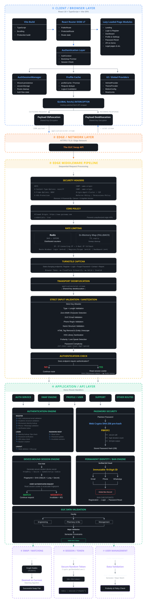

<h1>GUC Swap</h1>

### Group & Tutorial Exchange Platform for GUC Students

GUC Swap is a full-stack group and tutorial swapping platform built specifically for the German University in Cairo (GUC) student community. It features a **graph-based multi-way cycle detection engine** that discovers swap chains across up to 5 students, an **immutable 10-digit identity-bound ban system** that permanently excludes abusive actors, **device-bound session validation** via cryptographic fingerprinting, **transport payload obfuscation** on all API payloads, and a **3-tier email failover chain** ensuring authentication emails are delivered even during partial provider outages. Every API endpoint is protected by multi-window rate limiting, Cloudflare Turnstile CAPTCHA, and a comprehensive security header suite,all deployed on Cloudflare with PostgreSQL and Redis.

---

## 📂 Source Code Availability

The source code is available **upon request** for technical review.
If you're a recruiter, hiring manager, or technical reviewer interested in exploring the implementation, feel free to [get in touch](#-contact).

---

## 📸 Screenshot

  

---

## 📑 Table of Contents

- [Architecture](#-architecture)
- [Features](#-features)
- [Demo](#-demo)
- [Case Study](#-case-study)
- [Challenges & Solutions](#-challenges--solutions)
- [Technologies Used](#-technologies-used)
- [Disclaimer](#-disclaimer)
- [Contact](#-contact)

---

## 🏗 Architecture

---

## 🌟 Features

### 🔁 Graph-Based Multi-Way Swap Cycle Detection

- **DFS-based cycle detection algorithm** modeling the swap pool as a directed graph
- Discovers **multi-way swap cycles** of 2–4 intermediate students (depth-limited to 5)
- Handles **"any" preferences** as well-connected hub nodes that unlock longer chains
- **Intermediate pruning:** nodes with only 1 available swap are excluded from chains (they can only be endpoints)
- **Cycle validation:** every intermediate on a found cycle is verified for 2 available swaps before acceptance
- Results grouped by the **spot the user would receive** and organized by **cycle depth** (`depth_3`, `depth_4`, etc.)
- Capped at **15 cycles per depth**; iteration counter (`MAX_ITER = 10,000`) guarantees bounded compute on Workers

### 🔒 Immutable Identity Binding & Permanent Ban System

- **Permanent 10-digit identity** assigned to every user, bound directly to their verified GUC email in an isolated identity mapping table
- Deleting and re-registering deterministically re-assigns the **exact same 10-digit ID**,no bypass possible
- **Multi-dimensional ban enforcement** across email, phone number, and WhatsApp simultaneously
- Ban verification executes at **three checkpoints**: registration (pre-creation), login (post-verification), and password reset

### 📱 Device-Bound Session Validation via SHA-256 Fingerprinting

- Sessions bound to a **cryptographic device fingerprint** derived from User-Agent, Accept-Language, and a **persistent secure cookie** (httpOnly, secure, SameSite=Lax)
- On every authenticated request, the server recomputes the fingerprint and compares it to the stored value
- **Fingerprint mismatch** triggers immediate session invalidation,cookies deleted, 401 returned
- Stolen session tokens are **useless from a different device**, neutralizing session hijacking

### 🛡 Transport Payload Obfuscation on All API Payloads

- Frontend **monkey-patches the global `window.fetch`** to intercept requests to `api.gucswap.com`
- Outgoing JSON bodies are **obfuscated** and sent as `application/octet-stream`
- Backend middleware **deobfuscates** incoming payloads and **re-obfuscates** all JSON responses
- Adds a **friction layer** against casual DevTools inspection and automated scraping with **zero additional dependencies** and near-zero latency

### ⏳ Dual-Layer Rate Limiting with Redis and In-Memory Fallback

- **Multi-window configurations** parsed from human-readable strings (e.g., `"rate limiting via minute and hour and day"`)
- Per-route configurable limits,login allows per-minute, per-hour, and per-day; register and forget-password share a combined hourly/daily window
- Uses **Redis `INCR` with `EXPIRE`** for distributed counting when Redis is available
- Falls back to **in-memory `Map`** with TTL-based expiry and automatic sweep when Redis is unavailable
- IP identification via `CF-Connecting-IP` (Cloudflare) with `X-Real-IP` fallback

### 🔐 Comprehensive Security Header Suite

- **HSTS** (`max-age=31536000; includeSubDomains; preload`) enforces HTTPS
- **X-Content-Type-Options: nosniff** prevents MIME type sniffing
- **X-Frame-Options: DENY** prevents clickjacking
- **Cross-Origin-Opener-Policy: same-origin** and **Cross-Origin-Resource-Policy: same-origin** prevent cross-origin side-channel attacks
- **Content-Security-Policy** configured specifically for HTML and API responses (`default-src none; frame-ancestors none`)
- **Permissions-Policy** disables geolocation, microphone, and camera
- Server identification headers (`X-Powered-By`, `Server`, `X-AspNet-Version`) explicitly removed

### 🔏 Multi-Layer Input Validation and Sanitization

- **Strict field allowlisting** via `checkStrict`,unexpected request body fields cause immediate rejection
- **Zero-width character detection**,strings containing Unicode zero-width characters (U+200B–U+200D, U+FEFF) are rejected
- **GUC email regex enforcement**,only `@student.guc.edu.eg` emails accepted for registration
- **Phone number validation** against a comprehensive regex covering **60+ country codes**
- **HTML stripping** via custom `stripAllTags` + `htmlUnescape` + the `xss` library as an additional sanitization layer
- **Password complexity**: 12+ characters, uppercase, lowercase, digit, and special character required

### 🚫 Leet-Speak-Aware Profanity Filtering with N-Gram Matching

- **5,000+ word wordlist** covering English, Slang, and Franko profanities, pre-hashed in client-side bundles (no raw offensive words in frontend code)
- **Leet-speak normalization** maps special characters to letter equivalents (`@→a`, `4→a`, `8→b`, `3→e`)
- **Repeated character collapse** reduces sequences of 3+ identical characters (`"stuuupid"` → `"stupid"`)
- **N-gram matching** checks both individual tokens and multi-word combinations against the normalized token set

### 🔑 SHA-256 Hashed Token Management with Automatic Invalidation

- All tokens are **cryptographically secure URL-safe random strings** via `crypto.getRandomValues`
- Only the **secure hash** is stored in Redis with a **10-minute TTL**,raw token sent to user via email
- **Dual-key scheme**: `token:{hash}` stores the payload; `token_mapping:{identifier}` maps to the current hash
- New token issuance **automatically invalidates** the previous token for the same type and email
- Token consumption uses **Redis `GETDEL`** (atomic get-and-delete) preventing replay attacks
- `deleteAllTokensForEmail` clears all token types on password change

### 🗄 Redis-Cached Session Management with SHA-256 Token Hashing

- Session ID is a **secure random token** stored in an httpOnly, secure, SameSite=Lax cookie with a **24-hour TTL**
- Raw token is **never stored**,only its **secure hash** persists in the user session column and serves as the Redis cache key
- Redis caches full user profile data for **24 hours (86,400 seconds)**,authenticated requests resolve from cache in ~5ms
- **Server-side session revocation** works instantly for logout, password change, and device fingerprint mismatch
- Stateful approach chosen over JWT to enable **proactive session invalidation**

### 🔐 PBKDF2 Password Hashing with SHA-256 Pre-Hash Layer

- Two-layer scheme: **secure pre-hash** via Web Crypto API's `subtle.digest`, then **PBKDF2** with high iteration count and 64-byte output
- Salt is a **strong, unique secure salt** stored in secrets
- Pre-hash normalizes input before PBKDF2; PBKDF2 provides computational hardness making brute-force infeasible
- Password complexity enforced **server-side** at registration: minimum 12 characters, mixed case, digit, special character

### 📧 Email-Based Two-Factor Authentication with Magic Links

- Users with 2FA enabled receive a **magic link via email** after password verification
- Token is **single-use**, **time-limited (10 minutes)**, and **hashed before storage** in Redis
- Eliminates brute-force risks inherent to short numeric codes (no 6-digit code to guess)
- More accessible than TOTP for the GUC student population,no app installation required

### 🤖 Cloudflare Turnstile CAPTCHA Integration

- Protects **all state-changing endpoints**: registration, login, forget-password, contact, support, and report
- Turnstile operates **non-interactively** (managed/challenge mode),zero friction for legitimate users
- Token sent in request body, validated against Cloudflare's `siteverify` API on the backend
- Bot-driven registration spam, credential stuffing, and form flooding mitigated at the edge

### 📬 3-Tier Email Provider Failover Chain

- **Primary Email API**,fast, high-deliverability transactional messaging
- **Secondary Backup Email API**,automated fallback if the primary experiences outages or rate limits
- **Direct SMTP via Edge Sockets** (tertiary),raw TCP socket implementing STARTTLS, AUTH PLAIN, AUTH LOGIN, and AUTH CRAM-MD5 natively on the Cloudflare 
- Contact, support, and report emails routed through a **separate isolated dispatch path** via an internal network

### 🎓 GUC Academic Structure Validation

- Complete GUC academic structure encoded as constants: **6 faculties** mapping to their valid majors (Engineering with 15 majors, Pharmacy & Biotechnology with 4, Management Technology with 3, Applied Sciences & Arts with 3, Dentistry with 1, Law & Legal Studies with 1)
- Semester validation enforces that **10-semester faculties** (Dentistry, Pharmacy & Biotechnology, Engineering) allow semesters 1–10, while **8-semester faculties** allow only 1–8
- Same validation runs on **profile updates** to prevent users from editing into invalid states

### ⚠ Structured Error Handling and Information Disclosure Prevention

- Centralized error handler catches unhandled exceptions and maps them to **appropriate HTTP status codes**,no stack traces, database errors, or internal details ever reach clients
- **Strict preliminary validations** reject malformed requests early before reaching the database
- **Calibration delay** on early failures equalizes response latency between fast validation exits and full database queries to prevent **timing attacks**

### 🌐 CORS Configuration and Cookie Security

- CORS strictly allows only **`https://www.gucswap.com`** with `credentials: true`
- All cookies set with **httpOnly: true**, **secure: true**, **SameSite: "Lax"**, and **path: "/"**
- Session cookie has a **24-hour maxAge**
- On logout, all session and auth cookies explicitly invalidated and purged across domain scopes

### ⚛ React 19 Frontend Architecture with Lazy Loading and Route Guards

- Built with **React 19**, **TypeScript**, **Vite**, and **React Router DOM v7**
- All page components **lazy-loaded** via `React.lazy()` with a consistent `RouteFallback` spinner
- `RouteGuards` provides `ProtectedRoute` (redirects to `/login`) and `PublicRoute` (redirects to `/dashboard`)
- `AuthContext` uses a **bootstrap promise pattern** to prevent multiple concurrent session checks on mount
- Global wrappers: **HelmetProvider** (SEO), **ThemeProvider** (dark/light mode via next-themes), **MotionConfig** (respects `prefers-reduced-motion`), **ReactLenis** (smooth scrolling)

### 🧹 Frontend Auth Session Hygiene and Wizard State Cleanup

- Multi-step auth wizard state persisted in **sessionStorage** to survive accidental page reloads
- **Per-route cleanup**,navigating away from auth flows clears all auth-related wizard state
- Handles edge cases where users navigate to **footer pages** (privacy, terms) during an auth flow and return without losing progress

### 📦 Frontend Profile Caching with Invalidation

- Client-side profile cache using a **module-level variable** and **deduplication promise**
- Even if 5 components call `fetchCachedProfile` simultaneously, only **one HTTP request** is made
- Cache invalidated on **logout**, **unauthorized responses**, and **login**
- Zero additional dependencies for profile data management

---

## 🎥 Demo

A live instance of GUC Swap is deployed at **[GUC Swap](https://www.gucswap.com)**.

For the demo mode (no account required), click "View Demo" button on the live site to explore the platform's UI and swap interface.

---

## 📖 Case Study

A deep-dive into 20 engineering challenges solved across the full stack,from graph-based cycle detection and immutable identity binding to transport obfuscation and 3-tier email failover.

---

## ⚠ Challenges & Solutions

### Problem
Multi-way swaps aren't just A↔B exchanges, students form complex graphs where A wants what B has, B wants what C has, and C wants what A has, creating cycles across 3+ students. Finding these efficiently in a pool of hundreds is a graph theory problem.

### Solution
Each student is a node; a directed edge `i → j` exists when student i's desired group/tutorial matches student j's current one, or when student i accepts `"any"`. DFS starts from the current user (node 0) with depth limit 5. Two swap-specific pruning rules apply:

- **Intermediate eligibility:** A node can only appear as an intermediary if it has 2 available swaps (since intermediaries both give and receive a spot). The current user is exempt.
- **Cycle validation:** Every intermediate user on a found cycle is verified for 2 available swaps before acceptance.

---

### Problem

**A campus platform must permanently exclude abusive actors. Users bypass bans on typical platforms by deleting accounts and re-registering. The system needed an uncircumventable identity architecture.**

### Solution

Architected an **immutable 10-digit identity mapping** bound to the verified GUC institutional email in an isolated identity table. Since GUC issues only one email per student, deleting and re-registering always yields the **exact same identity footprint**. Ban enforcement checks **email, phone, and WhatsApp simultaneously** at three checkpoints (registration, login, password reset).

---

### Problem

**Session hijacking via stolen cookies is a critical threat. Standard cookie-based sessions provide no mechanism to detect use from a different device.**

### Solution

Implemented **device fingerprinting** that binds each session to a specific device. A secure random secret is stored as a persistent httpOnly cookie. The fingerprint is computed as a **SHA-256 hash of device properties and the secure cookie**. On every authenticated request, the server recomputes the fingerprint,a mismatch (different browser, device, or language) triggers **immediate session invalidation** with a 401 response.

---

### Problem

**Plaintext JSON in API payloads is trivially visible in browser DevTools, making casual reverse-engineering and scraping easy.**

### Solution

Implemented a **symmetric payload obfuscation layer** that wraps all API request and response bodies. The frontend monkey-patches `window.fetch` to obfuscate outgoing JSON and send it as `application/octet-stream`. The backend middleware mirrors this: deobfuscates incoming payloads and re-obfuscates all JSON responses. This adds a **friction layer against casual inspection** with zero additional dependencies and near-zero latency,explicitly not a security feature, but a deterrent.

---

### Problem

**API endpoints handling authentication are prime targets for brute-force attacks and denial-of-service. Rate limiting must work even if Redis is temporarily unavailable.**

### Solution

Implemented **multi-window rate limiting** parsed from human-readable strings (e.g., `"rate limiting via minute and hour and day"`). Each route has configurable limits. Uses **Redis `INCR` with `EXPIRE`** when available, with a fallback to an **in-memory `Map`** with TTL-based expiry and automatic sweep when Redis is unavailable. The shared window between register and forget-password prevents distributed abuse across endpoints.

---

### Problem

**Email delivery is critical for account verification, 2FA magic links, and password resets. Single-provider architectures create a single point of failure.**

### Solution

Built a **3-tier email delivery chain**: (1) Primary Email API for fast transactional messaging, (2) Secondary Backup Email API for automated fallback, and (3) **Direct SMTP via Edge Sockets** implementing the full SMTP protocol (EHLO, STARTTLS, AUTH, MAIL FROM, RCPT TO, DATA) natively on the Cloudflare . If the primary fails, it cascades to the secondary, then to raw SMTP,ensuring delivery across independent infrastructure tiers.

---

### Problem

**A platform for GUC students must enforce valid faculty-major-semester combinations. Invalid combinations (e.g., a "Dentistry" major in "Engineering" faculty) would corrupt the swap matching algorithm.**

### Solution

Encoded the **complete GUC academic structure** as a constants object mapping 6 faculties to their valid majors (Engineering with 15 majors including CSEN, MET, Networks, etc.). Semester validation enforces that 10-semester faculties allow semesters 1–10 while 8-semester faculties allow only 1–8. The same validation runs on **profile updates** to prevent users from editing their way into invalid states.

---

### Problem

**Unhandled exceptions can leak stack traces, database errors, or internal service details to clients. Rate limit errors must be distinguishable from other errors by the frontend.**

### Solution

Implemented a **centralized error handler** that maps exceptions to appropriate HTTP status codes,no stack traces, database errors, or internal details ever reach clients. **Strict preliminary validations** reject malformed requests early before reaching the database. A **calibration delay** on early failures equalizes response latency between fast validation exits and full database queries to prevent timing attacks.

---

## 🛠 Technologies Used

### Programming Language
- **TypeScript** - end-to-end type safety across backend and frontend

### Runtime & Deployment
- **Cloudflare** - edge runtime with sub-millisecond cold starts
- **Vite** - frontend build tool with HMR

### Frameworks
- **Hono** - lightweight, edge-first web framework for the API
- **React 19** - frontend UI library with concurrent features
- **React Router DOM v7** - client-side routing with lazy loading

### Database & Cache
- **PostgreSQL** - primary relational database for users, groups, swaps, and identity mappings
- **Redis** - session storage, token management, and distributed rate limiting

### Security
- **Cloudflare Turnstile** - non-interactive CAPTCHA for bot mitigation
- **Web Crypto API** - SHA-256 hashing, PBKDF2 key derivation, secure random generation
- **Transport Payload Obfuscation** - symmetric obfuscation on all API payloads

### Email
- **Primary Transactional Email API** - fast, high-deliverability messaging
- **Secondary Backup Email API** - automated failover provider
- **Direct SMTP via Edge Sockets** - native SMTP implementation on Cloudflare s

### Frontend Libraries
- **next-themes** - dark/light theme management
- **React Lenis** - smooth scrolling
- **Framer Motion** - animations with reduced-motion support
- **react-helmet-async** - SEO meta tag management

---

## ⚠ Disclaimer

GUC Swap is an independent, community-driven platform and is **not affiliated with, endorsed by, or officially connected to the German University in Cairo (GUC)**. The platform is provided as-is for educational and community use. Users are solely responsible for the accuracy of their profile information and for compliance with their university's policies regarding group and tutorial exchanges. The developer assumes no responsibility for any consequences arising from the use of this platform, including but not limited to scheduling conflicts, academic penalties, or misuse of shared contact information. By using GUC Swap, users agree to the [Terms of Service](https://www.gucswap.com/terms) and [Privacy Policy](https://www.gucswap.com/privacy).

---

# 📫 Contact

**Youssef Ahmed Abdelfatah**

🌐 **Portfolio**
https://usfahmed.dev

💻 **GitHub**
https://github.com/usfa7med

💼 **LinkedIn**
https://linkedin.com/in/usfahmed

✉️ **Email**
hello@usfahmed.dev
